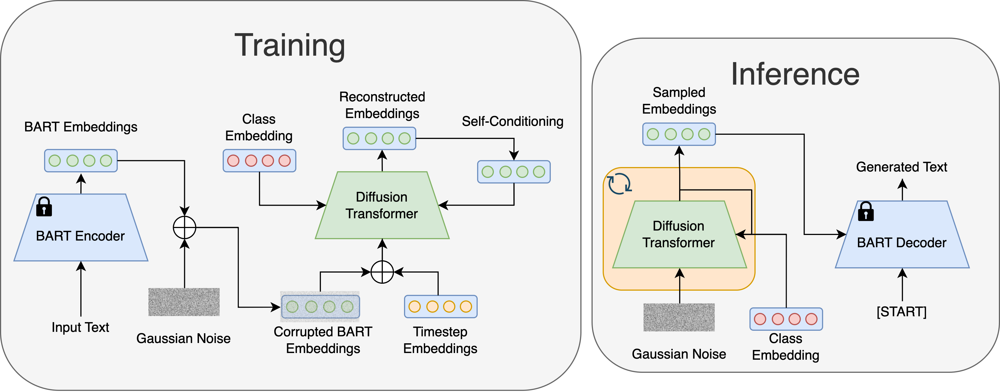

# Latent Diffusion for Language Generation

This is the official code release for

[**Latent Diffusion for Language Generation**](https://arxiv.org/abs/2212.09462).

by Justin Lovelace, Varsha Kishore, Chao Wan, Eliot Shekhtman, and Kilian Q. Weinberger



### Abstract
Diffusion models have achieved great success in modeling continuous data modalities such as images, audio, and video, but have seen limited use in discrete domains such as language. Recent attempts to adapt diffusion to language have presented diffusion as an alternative to existing pretrained language models. We view diffusion and existing language models as complementary. We demonstrate that encoder-decoder language models can be utilized to efficiently learn high-quality language autoencoders. We then demonstrate that continuous diffusion models can be learned in the latent space of the language autoencoder, enabling us to sample continuous latent representations that can be decoded into natural language with the pretrained decoder. We validate the effectiveness of our approach for unconditional, class-conditional, and sequence-to-sequence language generation. We demonstrate across multiple diverse data sets that our latent language diffusion models are significantly more effective than previous diffusion language models.

### Citation
```
@article{lovelace2024latent,
  title={Latent diffusion for language generation},
  author={Lovelace, Justin and Kishore, Varsha and Wan, Chao and Shekhtman, Eliot and Weinberger, Kilian Q},
  journal={Advances in Neural Information Processing Systems},
  volume={36},
  year={2024}
}
```


## Environment
A suitable environment can be created with the following commands. 
```bash
conda env create -f environment.yml
python -m spacy download en_core_web_sm
```

## Datasets

The dataset files for the ROCStories and QQP datasets are included in the `datasets/` directory. The other datasets are loaded from the HuggingFace Hub.

## Training

We provide example scripts for the ROCStories dataset with our default parameters. You can pre-train the language autoencoder with the BART-base model with
```bash
./scripts/autoencoder/bart_base_roc.sh
```

After this is trained, you can then train a latent diffusion model with
```bash
./scripts/diffusion/bart_latent_v-pred.sh
```

## Evaluation
To evaluate a trained model on the validation set, see the `scripts/diffusion/eval.sh` script for an example. The `--resume_dir` argument should be updated with the path of a trained model. Different sampling configurations can be explored by changing the `{num_samples, sampling_timesteps, sampler}` arguments. Running the evaluation on the test set can be done by using the `--eval_test` flag.

## Contact
Please open an issue if you have any questions about using this repo. I will following up with reference scripts for some of the other experimental settings.


## Acknowledgement
This work built upon excellent open-source implementations from [Lucidrains](https://github.com/lucidrains). Specifically, we adapted his Pytorch DDPM implementation ([link](https://github.com/lucidrains/denoising-diffusion-pytorch)), built upon his transformer implementation ([link](https://github.com/lucidrains/x-transformers)), and adapted his perceiver implementation for our language autoencoder ([link](https://github.com/lucidrains/flamingo-pytorch)).